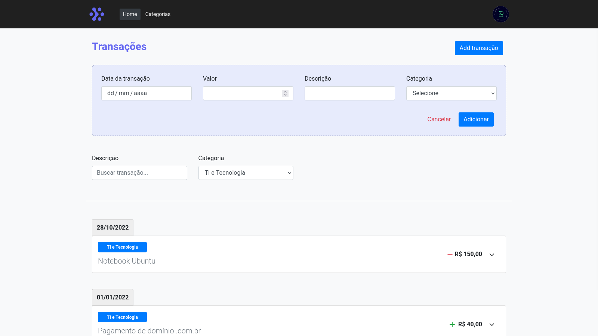

<h1 align="center"> Finanças Pessoais - Projeto prático Laravue by Tiago Matos </h1>

<p align="center">
  Projeto prático de gerenciamento de finanças pessoais, baseado no curso de Nuxt.js elaborado pelo Tiago Matos, Laravue.
</p>

<br>

<p align="center">
  
</p>

## 🚀 Tecnologias

Esse projeto foi desenvolvido com as seguintes tecnologias:

- [Vue.js](https://vuejs.org/)
- [Nuxt.js](https://nuxtjs.org/)
- [Json-Server](https://www.npmjs.com/package/json-server)
- [Day.js](https://day.js.org/)
- [Lodash](https://lodash.com/)

## 💻 Projeto

O projeto simula um gerenciamento de finanças pessoais, com lançamento de transações, edição em linha, adição e remoção de categorias e filtro de transações. Também usa o agrupamento de transações por data.

<h1 align="center"> Setup Front-end & Back-end</h1>

## 🔥 Front-end

Instale as dependências do projeto:

```
npm install
```

Rode a aplicação:

```
npm run dev
```

ou

```
npm run build
```

## 🔥 Back-end

Se não tiver o servidor JSON-SERVER instalado, execute-o com o comando abaixo:

```
npm install -g json-server
```

Rode o servidor json para fornecer um back-end para api.

```
cd static
json-server --watch db.json
```

Obs: o servidor deverá sempre ser iniciado primeiro, pois sua porta base é a localhost:3000
<br /><br /><br />

<h4 align="center">
 
  <br />
  Feito com ♥ no Ubuntu 22.04 LTS
</h1>
